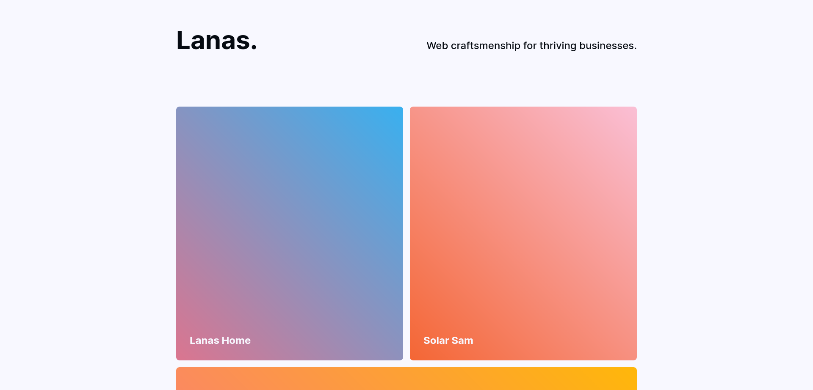

# Lanas.dev - building fast websites

This is the portfolio website of Lanas.

## About

Build with the follwing Tech Stack:

- [Nextjs](https://nextjs.org/)
- [Datocms](https://www.datocms.com/)
- [Tailwindcss](https://tailwindcss.com/)
- [Vercel](https://vercel.com/)
- [Formspree](https://formspree.io/)
- [Simple Analytics](https://simpleanalytics.com/)

Visit site: [Lanas.dev](https://lanas.dev)

## Todo

- [] fix footer social buttons
